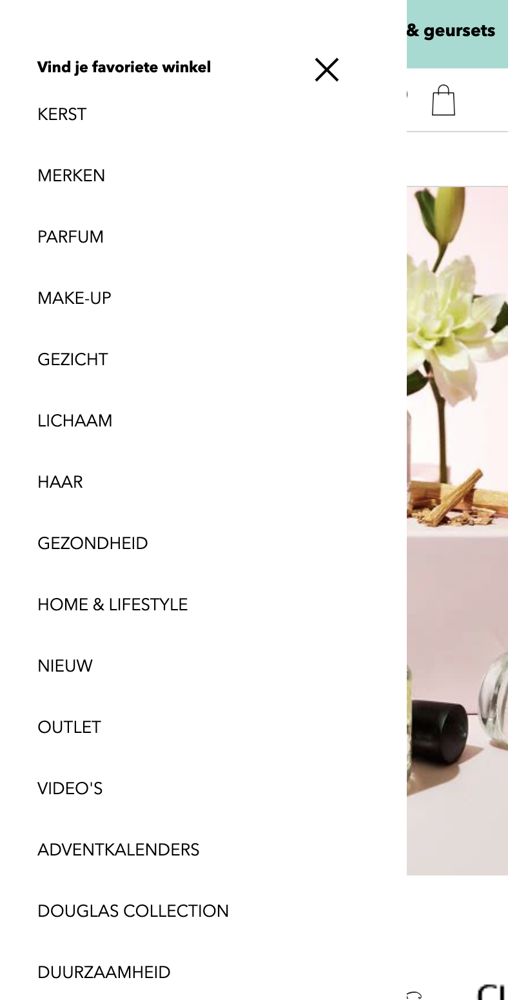
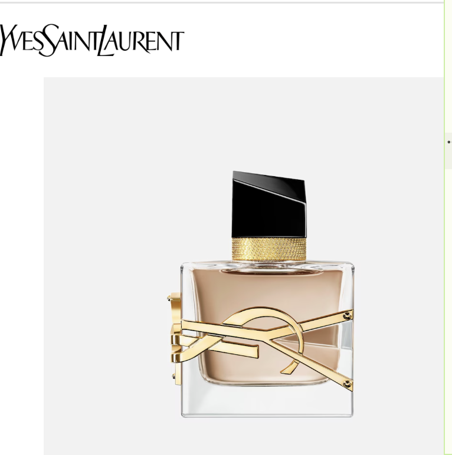

# Procesverslag
Markdown is een simpele manier om HTML te schrijven.  
Markdown cheat cheet: [Hulp bij het schrijven van Markdown](https://github.com/adam-p/markdown-here/wiki/Markdown-Cheatsheet).

Nb. De standaardstructuur en de spartaanse opmaak van de README.md zijn helemaal prima. Het gaat om de inhoud van je procesverslag. Besteedt de tijd voor pracht en praal aan je website.

Nb. Door *open* toe te voegen aan een *details* element kun je deze standaard open zetten. Fijn om dat steeds voor de relevante stuk(ken) te doen.

## Jij

  
uitwerken voor kick-off werkgroep

  ### Auteur:
  Esmee Westdijk 

  #### Je startniveau:
  Mijn startniveau is rood

  #### Je focus:
  Ik focus op surface plane
 

## Je website

  
uitwerken voor kick-off werkgroep

  ### Je opdracht:
  link naar de website die je gaat namaken óf de naam/omschrijving van je eigen ontwerp:
  [klik hier op naar de therme website te gaan] (https://www.douglas.nl/nl) 

  #### Screenshot(s) van de eerste pagina (small screen): 
  Home pagina
  

  #### Screenshot(s) van de tweede pagina (small screen):
  Collecties pagina 
  
 

## Toegankelijkheidstest 1/2 (week 1)

  
uitwerken na test in 2e werkgroep

  ### Bevindingen uit voiceover test
  Lijst met je bevindingen die in de test naar voren kwamen:
  - De voiceover leest geen afbeeldingen.
  - De voiceover leest de koppen voor en de hoeveelste kop het is van de pagina geeft het ook aan.  
  - De voiceover gaat langs de links en benoemd de link bij de naam van de text.  
  - De voiceover leest in de header alle hoofdmenu elementen voor, alleen niet de subelementen in een element.  
  - De website bestaat vooral uit links
  - Bij de functie nagivatie in de rotor zijn er wenig onderdelen beschikbaar 
  - Bij de functie koppen begint de voice over ergens midden op de homepagina pas. 
  - Op de pagina van een parfum worden de recenties overgeslagen door de voiceover. 
  - De website bevat weinig koppen. 
  - Als ik op de pagina van een parfum zit kan ik via de voiceover niet komen bij de button om het product toe te voegen aan het winkelmandje. 

  ### Bevindingen uit WCAG test 
 Lijst met je bevindingen die in de test naar voren kwamen:
 - Score bij content: alles yes 
 - Score bij global code: html niet valide 
 - Score bij keyboard: alles yes 
 - Score bij: mobile and touch: 3/4 yes - niet zo veel ruimte tussen de parfum plaatjes en het + knopje. 
 - Score bij headings: alles yes 
 - Score bij lists: no
 - Score bij images: 1/4 yes - Ik kan geen alt tekst vinden er staan alleen maar linkjes. Wel wordt er bij sommige alt 0 gegeven.  
 - Score bij media: 2/4 yes - geen captions en transcripts mogelijk. 
 - Score bij controls: alles yes 
 - Score bij apperance: 2/4 yes - dark en light mode is niet geactiveerd voor de website en de high-contrast optie modes is wordt niet ondersteunt. 
 - Score bij animations: alles yes
 - Score bij color contrast: alles yes 

(Dit is nog van mijn eerste gekozen website)!!
 Naast de checklist van WCAG heb ik ook bij de inspector tools gekeken naar mijn website hoe hij eruit ziet met verschillende visuele beperkingen. Hier zijn de volgende resultaten: 

 Blurred vison
 
 

 Reduced contrast 
 
 

 Protanopia (geen rood)
 

 Deuteranopia (geen groen)
 
 

 Tritanopia (geen blauw)
 
 

Archromatopsia (geen kleur)
 
 

 Daarnaast heb ik ook gekeken hoe mijn website eruit zag als ik in mijn instellingen het contrast zou verhogen en als ik de beweging verminder (reduce motion)

 Verhoogd contrast
 

 Minder beweging
 

## Breakdownschets (week 1)

  
uitwerken na afloop 3e werkgroep

  ### de hele pagina: 
  
  

  ### dynamisch deel (bijv menu): 
  

## Voortgang 1 (week 2)

  
uitwerken voor 1e voortgang

  ### Stand van zaken
  
   
   Ik vond deze section gemakkelijk gaan, hier had ik een beetje een idee van hoe ik de code moest opschrijven. 

   
   De section van "voor jou geselecteerd" vond ik erg moeilijk om te maken aangezien ik niet weet of ieder appart stukje tekst ook daadwerkelijk in een apparte p moet. Daarnaast lukt het mij ook niet om het euro teken te typen dus die mis ik ook nog in de tekst. 

   
   In deze section is het de bedoeling dat er video's staan van de website, een sort kleine reclame clips. Nu kan ik de video's niet downloaden en weet ik niet zo goed hoe ik zo'n soort een video zou moeten noteren in de html. 

  ### Agenda voor meeting
  samen met je groepje opstellen

  | Esmee          | (Mohammed)/Xavanna | Tom          |        |
  | ---            | ---                | ---          | ---              |
  | Menu           | en dit             | en ik dit    | en dan ik dat    |
  | Footer         | dit als er tijd is | nog een punt | dit wil ik zeker |
  | Video's        | ...                | ...          | ...              |

  ### Verslag van meeting
  hier na afloop snel de uitkomsten van de meeting vastleggen

  - Via network images en videos downloaden van de webiste 
  - Video uitzoeken hoe te maken met placeholder
  - Nette html code 
  - footer html aanmaken 
  - links in het bestand kan je linken met een # op de eigen pagina 

## Voortgang 2 (week 3)

  
uitwerken voor 2e voortgang

  ### Stand van zaken
  
  Hier zie je de code die ik samen met sanne heb toegepast tijdens de werkgroep. Ik kwam er niet helemaal uit hoe ik mijn icons in de header naast elkaar kreeg. Later bleek dat ik niet de selector had aangeroepen en daarom de afbeeldingen niet naast elkaar positioneerde. 

  
  Zie hier de uiteindelijke header na een verbetering van de code. 

  
  Hier zie je de code die ik zelf had toegepast om mijn slider voor de producten na te maken. In de werkgroep heb ik nagevraagd of dit goed was. Helaas beelk het beter te kunnen met grid omdat een aantal elementen over elkaar heen moesten worden geplaatst.

  
  Hier zie je de nieuwe code die ik met de uitleg van Sanne heb weten toepassen in mijn eigen code. Door wat uitleg en een voorbeeld code over grid begreep ik weer wat de bedoeling was. 

   
  Zie hier de silder hoe die er nu uit ziet. Alles staat met het grid op de juiste plek alleen vind ik de verhoudingen nog niet helemaal kloppen. 

   
  Daarnaast heb ik hier nog een voorbeeld van een slider waarvan ik zelf de layout heb gedaan. Dit heb ik ook allemaal gepositioneerd met flex en dergelijken. Nu vraag ik me nog even af of dit ook perse grid moet worden. 

  ### Agenda voor meeting
  samen met je groepje opstellen

  | Esmee          | Mo                 | Tom          | Sander           |
  | ---            | ---                | ---          | ---              |
  | Slider 2 flex  | @media             | svg's        | svg's            |
  | Positie slider | Responsive         |              | grid's           |
  | Video's/ form  | ...                | ...          | ...              |

  ### Verslag van meeting
  hier na afloop snel de uitkomsten van de meeting vastleggen

  - menu aanmaken geleerd
  - spans voor kruisje close button
  - responsive 
  - code opschoonen
- ...

## Toegankelijkheidstest 2/2 (week 4)

  
uitwerken na test in 9e werkgroep

  ### Bevindingen
  Lijst met je bevindingen die in de test naar voren kwamen (geef ook aan wat er verbeterd is):

  Lijst met je bevindingen die in de test naar voren kwamen:
 - Score bij content: alles yes 
 - Score bij global code: html valide 
 - Score bij keyboard: alles yes 
 - Score bij: mobile and touch: alles yes 
 - Score bij headings: alles yes 
 - Score bij lists: yes
 - Score bij images: 2/3 yes - allen de decorative images hebben geen 0 null als alt. 
 - Score bij media: 2/4 yes - geen captions en transcripts mogelijk. 
 - Score bij controls: alles yes 
 - Score bij apperance: 3/4 yes
 - Score bij animations: alles yes 
 - Score bij color contrast: 3/4 - text overlapt images.  

 Wat er verbeterd is:
 - html code is valide 
 - Bij moblie en touch: is er nu genoeg ruimte tussen interactieve elementen. 
 - Bij lists: worden list elementen gebruikt voor list content. 
 - Bij Images: Alle images hebben een alt atribute.
 - Bij apparance: de webiste heeft nu dark en light mode.

## Voortgang 3 (week 4)

  
uitwerken voor 3e voortgang

  ### Stand van zaken
   
  Hier zie je breadcrum bolletjes om de slider van de foto's voor gebruiksvriendelijker te maken. Mijn bolletjes staan er wle en ik heb ze gemaakt alleen werken ze nog niet als ik er op klik. Dit wil ik deze voortgang na vragen. 

   
  Ik heb van de studentassistent Ali een paar tips gekregen hoe een hamburger menu werkt en we hebben er samen even naar gekeken hoe we het nog konden toepassen in mijn code. Het was een aardig gedoetje met vaak de nav moeten vervangen maar het is uiteindelijk gelukt. 

   
  Hier zie je dat ik eindelijk de darkmodus werkend heb gekregen. Ik heb via de slides van de les de invert filter weten toe te passen op mijn foto's. De gehele pagina is nu ook netjes darkmode dat de afbeeldingen mee veranderen. Alleen mijn menu nog niet. Dit wil ik na vragen tijdens het gesprek. 

  ### Agenda voor meeting
  samen met je groepje opstellen

  | Esmee          | Alycia             | Tom          | Sander           |
  | ---            | ---                | div gebruik  | grid spacing     |
  | li bolletjes   | z-index            | dark mode    |                  |
  | video javascript | postion:fixed;   |              |                  |
  | darkmode menu  | ...                |              | ...              |
  | hover dialoog  | 
  | grootte video's 

  ### Verslag van meeting
  hier na afloop snel de uitkomsten van de meeting vastleggen

  - li bolletjes werken nu, er moest een apparte selectror voor worden aan gemaakt met een padding ne hij moest heel specifiek zijn aangezien een andere code deze bolletjes ook aanpaste. 
  - Helaas waren we erg lang met mijn vraag over de bolletjes bezig waardoor dat het enige is wat ik heb kunnen vragen.
  - geleerd over position sticky en relative en een goede opbouw van z-index structuur (Bij Alycia)
  - geleerd responsive een video laten schalen (Bij Tom)

## Eindgesprek (week 5)

  
uitwerken voor eindgesprek

  ### Je uitkomst - karakteristiek screenshots:
  
  

  ### Dit ging goed/Heb ik geleerd: 
  Korte omschrijving met plaatjes

   
  Ik heb voor de 2de pagina een form moeten maken voor de luchtjes opties qua groote. Hier ben ik erg lang mee bezig geweest aangezien het een form is met fieldsets en dan ook nog goed positioneren met grid. Ook al duurd het lang is het mij wel erg goed afgegaan. 

   
  Ik heb met javascript geleerd hoe ik een dialoog tevoorschijn moet laten komen en hoe ik deze ook weer kan verwijderen van het beeldscherm met een close button. door dat ik de lesstof nog goed had onthouden gimg dit redelijk soepel. 

   
   
   
  Hier zie je dat ik heb geleerd hoe ik met gebruik van has() op de radiobutton een kerst thema toevoeg aan de pagina. Er verschijnen dan belletjes boven aan die bewegen als je er overheen hoverd en dat geld ook voor de blaadjes. Dit heb ik gedaan met keyframes. Daarnaast heb ik ook nog een rendier animatie toegevoegd die zich over de pagina we weegt en als het ware over de pagina heen en weer loopt. 
  

  ### Dit was lastig/Is niet gelukt:
  Korte omschrijving met plaatjes

  
  Het is mij helaas niet gelukt om het eerste form in de footer de lay-out te geven die ik wilde. Ik wil namelijk dat het witte vlak ook op de background image zit en nu overlapt hij het aan de rechter kant. Het is waarschijnlijk een simpele regel code maar helaas kom ik er niet uit. 

  
  Het yves Saint Laurant logo moet in het midden van de pagian komen. Dit is mij helaas niet gelukt. Ik weet ook niet waarom hij niet werkt aangezien alle andere dingen die ik het element toe zeg gebeuren wel behalve de positie. 

  
  Het is mij helaas niet gelukt om een video toe te voegen aan deze thumbnail. Ik zou dan namelijk van deze foto een button moeten maken. Maar zodra ik dat deed was mijn hele grid verschoven. Ook als ik netjes mijn css daarop toepaste kwam het niet goed. 

## Bronnenlijst

  
continu bijhouden terwijl je werkt

  Nb. Wees specifiek ('css-tricks' als bron is bijv. niet specifiek genoeg). 
  Nb. ChatGpT en andere AI horen er ook bij.
  Nb. Vermeld de bronnen ook in je code.

  1. https://www.w3schools.com/html/html_forms.asp 
  2. https://www.google.com/url?sa=i&url=https%3A%2F%2Fwww.douglas.nl%2Fnl%2Fb%2Fdouglas-collection%2Fparfum%2Fb9834_01&psig=AOvVaw1utxFVt9cesiwsbMxwQ6I8&ust=1732287388978000&source=images&cd=vfe&opi=89978449&ved=0CBQQjRxqFwoTCOiW6MXX7YkDFQAAAAAdAAAAABAE 
  3. https://www.google.com/url?sa=i&url=https%3A%2F%2Fwww.douglas.nl%2Fnl%2Fc%2Fendless-summer%2Fzomerse-geuren%2F8604&psig=AOvVaw2l6vufRG73jqh7Oi4XZxBC&ust=1732287047512000&source=images&cd=vfe&opi=89978449&ved=0CBQQjRxqFwoTCKjS1aXW7YkDFQAAAAAdAAAAABAZ
  4. https://www.google.com/url?sa=i&url=https%3A%2F%2Fwww.nieuwsblad.be%2Fcnt%2Fdmf20200818_93606375&psig=AOvVaw2l6vufRG73jqh7Oi4XZxBC&ust=1732287047512000&source=images&cd=vfe&opi=89978449&ved=0CBQQjRxqFwoTCKjS1aXW7YkDFQAAAAAdAAAAABAe
  5. https://www.google.com/url?sa=i&url=https%3A%2F%2Fwww.testyourparfum.com%2F10-lekkerste-mannen-luchtjes-in-2021%2F&psig=AOvVaw2SEHUIyQjTn-M3wZY9_OgP&ust=1732287496987000&source=images&cd=vfe&opi=89978449&ved=0CBQQjRxqFwoTCMDS8fnX7YkDFQAAAAAdAAAAABAE 
  6. https://www.google.com/url?sa=i&url=https%3A%2F%2Fwww.talkiesmagazine.nl%2Fbeauty%2Fparfumetiquette%2F&psig=AOvVaw2SEHUIyQjTn-M3wZY9_OgP&ust=1732287496987000&source=images&cd=vfe&opi=89978449&ved=0CBQQjRxqFwoTCMDS8fnX7YkDFQAAAAAdAAAAABAO
  7. https://www.google.com/url?sa=i&url=https%3A%2F%2Fcitymagazine.si%2Fnl%2Fherfstmagie-10-beste-damesparfums-voor-herfst-2024%2F&psig=AOvVaw2SEHUIyQjTn-M3wZY9_OgP&ust=1732287496987000&source=images&cd=vfe&opi=89978449&ved=0CBQQjRxqFwoTCMDS8fnX7YkDFQAAAAAdAAAAABAV
  8. https://depositphotos.com/nl/vectors/heart-icon.html
  9. https://nl.vecteezy.com/gratis-vector/pijltje-naar-beneden
  10. bron:https://nl.dreamstime.com/vinkje-tick-icon-no-image120599675
  11. Bron: svg van de douglas site via inspecteren
  12. https://www.google.com/url?sa=i&url=https%3A%2F%2Fwww.flaticon.com%2Ffree-icon%2Ftruck_691038&psig=AOvVaw2iHPJrNJpcUOtoBDwMH2KW&ust=1733488906984000&source=images&cd=vfe&opi=89978449&ved=0CBQQjRxqFwoTCNimzdTTkIoDFQAAAAAdAAAAABAE
  13. https://www.google.com/url?sa=i&url=https%3A%2F%2Fwww.flaticon.com%2Ffree-icon%2Fshop_126122&psig=AOvVaw3wCyRO11o5LeUJHsYZ9lJO&ust=1733489111913000&source=images&cd=vfe&opi=89978449&ved=0CBQQjRxqFwoTCLDK_qfUkIoDFQAAAAAdAAAAABAE
  14. bron: Chatgpt.
            Promt: <video>
                   <source src="videos/video_ysl.mp4" type="video/mp4"> 
                   </video> waarom werkt dit niet
            Antwoord: De <video>-tag zonder controls toont de video, maar zonder bedieningsknoppen (zoals afspelen, pauzeren, etc.). Als je geen bedieningsknoppen toevoegt, kun je de video niet bedienen.
            Oplossing: Voeg het controls-attribuut toe aan de <video>-tag:
  15. codepen Sanne lesstof @font-face
  16. codepen Sanne lesstof filter invert
  17. https://www.a11yproject.com/posts/how-to-hide-content/ voor visually-hidden class
  18. bron: chatGPT voor schaaling van de afbeelding. 
      Promt: hoe krijg ik de afbeeldingen precies zoals op de foto in breedte en hoogte? 
      Antwoord: width: 260px en aspect-ratio: 3 / 4: Hiermee zorg je voor een consistente breedte en hoogteverhouding (3:4), zoals in je voorbeeld.
      object-fit: cover in de img: Dit zorgt ervoor dat de afbeelding de hele container vult zonder vervorming, terwijl het beeld wordt bijgesneden als dat nodig is.
19. bron: Chat-gpt. 
    Promt: hoe zorg ik ervoor dat als de text te lang is voor in het grid het de text afmaakt met ...?
    Antwoord: Je kunt ervoor zorgen dat tekst afgekapt wordt en eindigt met een ellips (...) door gebruik te maken van de CSS-eigenschap text-overflow. Dit werkt in combinatie met overflow: hidden en white-space: nowrap.*/
20. codepen lesstof keyframes 
21. bron: Ali student assisent hamburger menu
22. bron: sanne voortgangles uitleg formulier in header.
23.bron: ChatGpt
  Promt: hoe krijg ik de buttons in de input?
  Antwoord: Formulier als container: Het form-element krijgt position: relative, zodat we de knoppen absoluut kunnen positioneren ten opzichte van het formulier.
  Input padding: De input krijgt padding-right: 50px zodat er voldoende ruimte is voor de knoppen aan de rechterkant van de input.
  Knoppen positioneren: De knoppen krijgen position: absolute, zodat ze zich precies boven de input bevinden. De top: 50% en transform: translateY(-50%) zorgen ervoor dat de knoppen verticaal gecentreerd worden.
  Knoppen rechts plaatsen: De right-eigenschap bepaalt de horizontale positie van de knoppen. De eerste knop (met het kruisje) wordt op right: 10px geplaatst, en de tweede knop (met het vergrootglas) wordt verder naar rechts geplaatst door right: 40px.
  Afbeelding aanpassen: De afbeeldingen in de knoppen worden met width: 20px aangepast, maar je kunt de grootte naar wens wijzigen.*/ 

